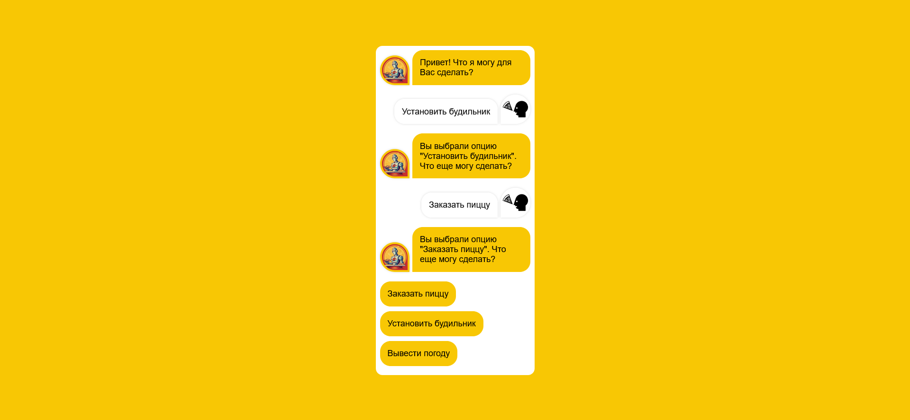

Задание по vue (optimalcity)

## Table of contents

- [Обзор](#обзор)
  - [Скриншот](#скриншот)
  - [Ссылки](#ссылки)
- [Что и как?](#что-и-как?)
  - [Сделано с использованием](#сделано-с-использованием)

## Обзор

### Скриншот

### Ссылки

- Live Site URL: [https://effortless-dolphin-e42076.netlify.app](https://effortless-dolphin-e42076.netlify.app)

## Что и как?

### Сделано с использованием

- HTML5
- CSS
- JavaScript
- Vue
